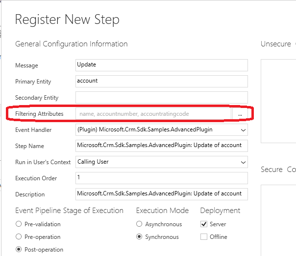

# Include filtering attributes with plug-in registration

[!INCLUDE[cc-data-platform-banner](../../../../includes/cc-data-platform-banner.md)]

**Category**: Performance

**Impact potential**: Medium

## Symptoms

If no filtering attributes are set for a plug-in registration step, then the plug-in will execute every time an update message occurs for that event.  A combination of no filtering attributes and auto-save functionality could lead to unnecessary plug-in executions causing undesirable behavior and degrade performance.

## Guidance

Most plug-ins registered for an entity's update message do not need to execute on all updates. Usually, there is only a need to process certain logic when a specific attribute or attributes have changed. In order to prevent extra processing in the environment, minimize the logic needed in a plug-in and all the update to complete as quickly as possible, it is highly recommended that plug-in step registrations also include filtering attributes for update messages.

## Additional information

Filtering attributes are a list of entity attributes that, when changed, cause the plug-in to execute.  These attributes can be set when registering the plug-in using the Plug-in Registration tool. If no attributes are set, then the plug-in will execute every time an update message occurs. Updates can occur for a variety of reasons. When auto-save is turned on in the environment, it can occur multiple times during the session of user when on an entity form. If filtering attributes are not specified, then the plug-in will execute for any attribute change to the designed entity.

### See also

[Register a plug-in](../../register-plug-in.md)
[Disable auto-save in a model-driven app](/powerapps/maker/model-driven-apps/manage-auto-save)

[!INCLUDE[footer-include](../../../../includes/footer-banner.md)]