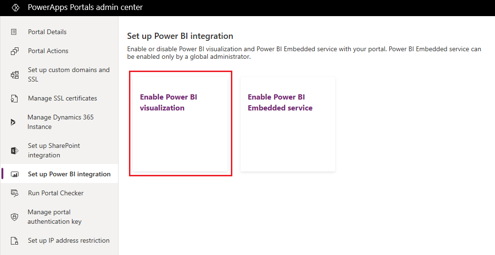
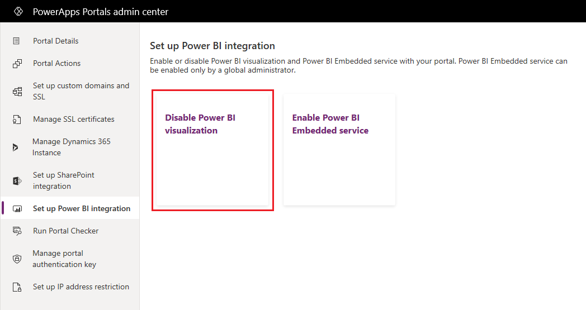

# Set up Power BI integration

Power BI is one of the best tools to deliver insights with simple and interactive visualization. To view dashboards and reports from Power BI on web pages in a portal, you must enable Power BI visualization from the Power Apps portals admin center. You can also embed dashboards and reports created in the new workspace of Power BI by enabling the Power BI Embedded service integration.

> [!NOTE]
> - You must have an appropriate Power BI license.
> - To use Power BI Embedded service, you must have an appropriate Power BI Embedded license. For more information, see [Licensing](https://docs.microsoft.com/power-bi/developer/embedded-faq#licensing).
> - Ensure **Embed content in apps** is *Enabled* in your Power BI tenant [Developer settings](https://docs.microsoft.com/power-bi/guidance/admin-tenant-settings#developer-settings). When disabled, portal can't render embedded Power BI dashboard or report.

## Enable Power BI visualization

Enabling Power BI visualization allows you to embed dashboards and reports on web pages in a portal by using the *powerbi* Liquid tag.

1.	Open [Power Apps portals admin center](admin-overview.md).

2.	Go to **Set up Power BI integration** > **Enable Power BI visualization**.

    > [!div class=mx-imgBorder]
    > 

3.	Select **Enable** in the confirmation message. While Power BI visualization is being enabled, the portal restarts and will be unavailable for a few minutes. A message appears when Power BI visualization is enabled.

Customizers can use the [powerbi](../liquid/portals-entity-tags.md#powerbi) Liquid tag to embed Power BI dashboards and reports on web pages in a portal. While embedding the Power BI content, customizers can use [filter parameters](https://docs.microsoft.com/power-bi/service-url-filters) to create personalized views. More information: [powerbi Liquid tag](../liquid/portals-entity-tags.md#powerbi)

### Disable Power BI visualization

1.	Open [Power Apps portals admin center](admin-overview.md).

2.	Go to **Set up Power BI integration** > **Disable Power BI visualization**.

    > [!div class=mx-imgBorder]
    > 

3. Select **Disable** in the confirmation message. While Power BI visualization is being disabled, the portal restarts and will be unavailable for a few minutes. A message appears when Power BI visualization is disabled.

## Enable Power BI Embedded service

Enabling the Power BI Embedded service allows you to embed dashboards and reports created in the new workspace of Power BI. The dashboards and reports are embedded on webpages in a portal by using the powerbi Liquid tag.

**Prerequisites**: Before enabling the Power BI Embedded service, ensure that you have created your dashboards and reports in the new workspace in Power BI. After creating the workspace, provide admin access to the global administrator so the workspaces are displayed in the Power Apps portals admin center. For more information on creating new workspaces and adding access to them, see [Create the new workspaces in Power BI](https://docs.microsoft.com/power-bi/service-create-the-new-workspaces).

> [!NOTE]
> Ensure that Power BI visualization is enabled for the powerbi Liquid tag to work.

**To enable Power BI Embedded service:**

1. Open [Power Apps portals admin center](admin-overview.md).

2. Go to **Set up Power BI integration** > **Enable Power BI Embedded service**.

    > [!div class=mx-imgBorder]
    > 

3. In the **Enable Power BI Embedded service integration** window, select, and move the Power BI workspaces from which dashboards and reports need to be displayed in your portal to the **Selected workspaces** list.

    > [!div class=mx-imgBorder]
    > 
    
    > [!NOTE]
    > After you add workspaces to the **Selected workspaces** list, the databases and reports are rendered after a few minutes.
    

4. Select **Enable**. While Power BI Embedded service is being enabled, the portal restarts and is unavailable for a few minutes. A message appears when Power BI Embedded service is enabled.

You must now create a security group, and add it to your Power BI account. For more information, see [Create security group and add to Power BI account](#create-security-group-and-add-to-power-bi-account).

### Create security group and add to Power BI account

After enabling the Power BI Embedded service integration, you must create a security group in Azure Active Directory, add a member to it, and then add the security group in Power BI through the Power BI admin portal. This allows the dashboards and reports created in new Power BI workspaces to be displayed in the portal.

> [!NOTE]
> You must sign in with the same Global administrator account that you used to enable the Power BI Embedded service.

**Step 1: Create a security group**

1. Sign in to the [Azure portal](https://portal.azure.com) using a Global administrator account for the directory.

2. Select **Azure Active Directory**, **Groups**, and then select **New group**.

3. On the **Group** page, enter the following information:

    - **Group type**: Security.

    - **Group name**: Portal Power BI Embedded service.

    - **Group description**: This security group is used for Portal and Power BI Embedded service integration.

    - **Membership type**: Assigned.

      > [!div class=mx-imgBorder]
      > 

4. Select **Create**.

**Step 2: Add a group member**

**Prerequisite**: Before adding a member to the security group, you must have the portal's application ID with you. The portal's application ID is available on the **Portal Details** tab in [Power Apps portals admin center](admin-overview.md).

1. Sign in to the [Azure portal](https://portal.azure.com) using a Global administrator account for the directory.

2. Select **Azure Active Directory**, and then select **Groups**.

3. From the **Groups - All groups** page, search for the **Portal Power BI Embedded service** group, and select it.

    > [!div class=mx-imgBorder]
    > 

4. From the **Portal Power BI Embedded service Overview** page, select **Members** from the **Manage** area.

5. Select **Add members**, and enter the portal's application ID in the text box.

6. Select the member from the search result, and then choose **Select**.

    > [!div class=mx-imgBorder]
    > 

**Step 3: Power BI setup**

1. Sign in to [Power BI](https://powerbi.microsoft.com) using a Global administrator account for the directory.

2. Select **Settings** in the top right of the Power BI service, and choose **Admin portal**.

    > [!div class=mx-imgBorder]
    > 

3. Select **Tenant settings**.

4. Under the **Developer settings** section, select **Allow service principals to use Power BI APIs**.

5. In the **Specific security groups** field, search for the **Portal Power BI Embedded service** group, and select it.

    > [!div class=mx-imgBorder]
    > 

6. Select **Apply**.

Customizers can now use the [powerbi](../liquid/portals-entity-tags.md#powerbi) Liquid tag to embed Power BI dashboards and reports from new Power BI workspaces on webpages in a portal. To use Power BI Embedded service, the authentication type must be specified as **powerbiembedded**. While embedding the Power BI content, customizers can use [filter parameters](https://docs.microsoft.com/power-bi/service-url-filters) to create personalized views. More information: [powerbi Liquid tag](../liquid/portals-entity-tags.md#powerbi).

### Manage the Power BI Embedded service

1. Open [Power Apps portals admin center](admin-overview.md).

2. Go to **Set up Power BI integration** > **Manage Power BI Embedded service**.

    > [!div class=mx-imgBorder]
    > 

3. In the **Manage Power BI Embedded service integration** window, remove, or move the Power BI workspaces from which dashboards and reports need to be displayed in your portal to the **Selected Workspaces** list.

    > [!div class=mx-imgBorder]
    > 
    
    > [!NOTE]
    > After removing the workspaces from the **Selected Workspaces** list, it can take up to 1 hour to reflect the changes. Until then, the databases and reports are rendered on the portal without any issues.

4. Select **Save**.

### Disable the Power BI Embedded service

1.	Open [Power Apps portals admin center](admin-overview.md).

2.	Go to **Set up Power BI integration** > **Manage Power BI Embedded service**.

    > [!div class=mx-imgBorder]
    > 

3. In the **Manage Power BI Embedded service integration** window, select **Disable Power BI Embedded service integration**.

    > [!div class=mx-imgBorder]
    > 

4. Select **Save**.

5. Select **OK** in the confirmation message. While Power BI Embedded service is being disabled, the portal restarts and is unavailable for a few minutes. A message appears when Power BI Embedded service is disabled.

## Limitations

- Power Apps portals doesn't support [Azure Analysis Services live connections](https://docs.microsoft.com/power-bi/developer/embedded/embedded-row-level-security#working-with-analysis-services-live-connections). You can use Analysis Services in import mode with row-level security (RLS) applied in the report instead of Analysis Services.
- Power Apps portals doesn't support guest users for Power BI dashboards and reports. The following message is displayed when a guest user tries to sign-in to Power BI on the portal page:   `Selected user account does not exist in tenant '[Tenant Name]' and cannot access the application '[App ID]' in that tenant. The account needs to be added as an external user in the tenant first. Please use a different account.`
- For more information about Power BI Embedded service limitations, see [Considerations and limitations](https://docs.microsoft.com/power-bi/developer/embed-service-principal#considerations-and-limitations).

### Rendering Power BI report on my portal page fails with the following error:

*A configuration error occurred while rendering your report.*

This can happen due to multiple reasons such as:

- Your [Power BI Embedded configuration](#enable-power-bi-embedded-service) is incorrect.
- [Row-level security](https://docs.microsoft.com/power-bi/admin/service-admin-rls) in Power BI is enabled but you didn't pass roles in [Power BI component configuration](../add-powerbi.md) (Advanced settings), or *roles* parameter in the [powerbi liquid tag](../liquid/portals-entity-tags.md#powerbi).
- **Embed content in apps** in Power BI [Developer Settings](https://docs.microsoft.com/power-bi/admin/service-admin-portal#developer-settings) is not enabled.

## Privacy notice  

[!INCLUDE[cc_privacy_powerbi_tiles_dashboards](../../../includes/cc-privacy-powerbi-tiles-dashboards.md)]

## Next steps

[Add a Power BI component to a webpage using the portals Studio](../add-powerbi.md)

### See also

- [Add a Power BI report or dashboard to a webpage using liquid tag in portal](add-powerbi-report.md)
- [powerbi Liquid tag](../liquid/portals-entity-tags.md#powerbi)
- [Microsoft Learn: Integration with Power BI](https://docs.microsoft.com/learn/modules/portals-integration/3-power-bi)

[!INCLUDE[footer-include](../../../includes/footer-banner.md)]